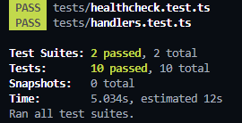
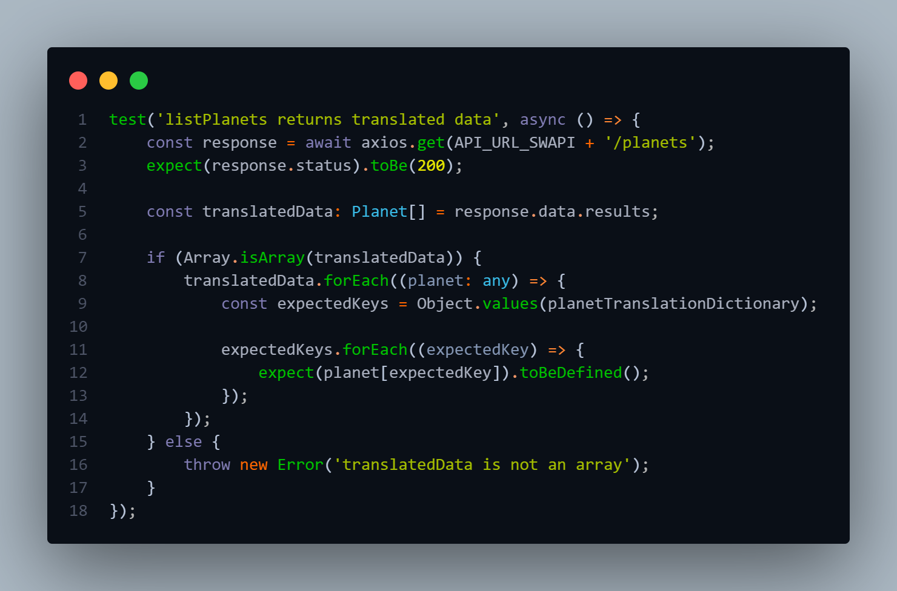

# Serverless API: Typescript, DynamoDB, Jest and SWAPI

## Getting up and running
First install `serverless` and get that up and running. documentation [here](https://serverless.com/framework/docs/providers/aws/guide/quick-start/).

You can use the standard `sls` commands or utilise the npm scripts in the project.

Then:

```
npm install
```

## Deployment - Dev

```
serverless deploy
```

## Deployment - Prod
```
serverless deploy:prod
```

## To remove:
```
npm run remove
```

# API interactions
The API url can be found either the console output, or programatically accessed via the `.serverless/output.json` object.

## GET: Healthcheck
Test the service is up

```
/healthcheck
```
#### Deployed:
[healthcheck](https://c04nvk5s5e.execute-api.us-east-1.amazonaws.com/healthcheck)

# SWAPI integration

### GET: List Translated People

Retrieve a list of character names translated to Spanish using the [SWAPI People Endpoint](https://swapi.py4e.com/api/people/?format=json).
```
/names
```
#### Deployed:
 List of translated [characters](https://mwy9htpnok.execute-api.us-east-1.amazonaws.com/names).
 ```json
{
  [
    {
      "nombre": "Luke Skywalker",
      "altura": "172",
      "masa": "77",
      "color_del_cabello": "blond",
      "color_de_piel": "fair",
      "color_de_ojos": "blue",
      "año_de_nacimiento": "19BBY",
      "género": "male",
      "planeta_natal": "https://swapi.py4e.com/api/planets/1/",
      "películas": [
        "https://swapi.py4e.com/api/films/1/",
        "https://swapi.py4e.com/api/films/2/",
        "https://swapi.py4e.com/api/films/3/",
        "https://swapi.py4e.com/api/films/6/",
        "https://swapi.py4e.com/api/films/7/"
      ],
      "especies": [
        "https://swapi.py4e.com/api/species/1/"
      ],
      "vehículos": [
        "https://swapi.py4e.com/api/vehicles/14/",
        "https://swapi.py4e.com/api/vehicles/30/"
      ],
      "naves_estelares": [
        "https://swapi.py4e.com/api/starships/12/",
        "https://swapi.py4e.com/api/starships/22/"
      ],
      "creado": "2014-12-09T13:50:51.644000Z",
      "editado": "2014-12-20T21:17:56.891000Z",
      "URL": "https://swapi.py4e.com/api/people/1/"
    },
    ...
  ]
}
``` 


### GET: List Translated Planets

Retrieve information about planets translated to Spanish using the  [SWAPI Planets Endpoint](https://swapi.py4e.com/api/planets/?format=json).
```
/planets
```
#### Deployed:
 List of translated [planets](https://mwy9htpnok.execute-api.us-east-1.amazonaws.com/planets).

```json
{
  [  
    {
      "nombre": "Tatooine",
      "período de rotación": "23",
      "período orbital": "304",
      "diámetro": "10465",
      "clima": "arid",
      "gravedad": "1 standard",
      "terreno": "desert",
      "agua en la superficie": "1",
      "población": "200000",
      "residentes": [
        "https://swapi.py4e.com/api/people/1/",
        "https://swapi.py4e.com/api/people/2/",
        "https://swapi.py4e.com/api/people/4/",
        "https://swapi.py4e.com/api/people/6/",
        "https://swapi.py4e.com/api/people/7/",
        "https://swapi.py4e.com/api/people/8/",
        "https://swapi.py4e.com/api/people/9/",
        "https://swapi.py4e.com/api/people/11/",
        "https://swapi.py4e.com/api/people/43/",
        "https://swapi.py4e.com/api/people/62/"
      ],
      "URL": "https://swapi.py4e.com/api/planets/1/"
    },
    ...
  ]
}
```

# CRUD Operations

### POST: Create car
```
/car
```
#### Deployed:
 CREATE [endpoint](https://c04nvk5s5e.execute-api.us-east-1.amazonaws.com/car).

Copy and paste the following JSON object into the request body:
```json
{
    "name": "toyota",
    "description" : "toyota car",
    "brand" : "toyota",
    "price": "10000",
    "stock": 1
}
```

### GET: Get cars
```
/carList
```
#### Deployed:
 GET CARS [endpoint](https://c04nvk5s5e.execute-api.us-east-1.amazonaws.com/carList).

```json
[
  {
    "brand": "toyota",
    "stock": 1,
    "carID": "77b9a931-133c-4e33-82e0-fa41d8f1c337",
    "description": "toyota car",
    "price": "10000",
    "name": "toyota"
  }
]
```
 
# Testing
run
```
npm run test
```
### Test results:


## Example test:


## Checklist 
- [x] Crear ima API en Node.js con el framework Serverless para un despliegue en AWS
- [x] Adaptar y transformar los modelos de la API SWAPI a español.
- [x] Integrar el API de prueba de STAR WARS, uno o más endpoints.
- [x] Crear un modelo a mi eleccion mediente el uso de un endpoint POST y almacenar la data dentro de una base de datos.
- [x] Crear un endpoint GET que muestre la data almacenada.

## Puntos obligatorios
- [x] Más de 2 endpoints GET y POST.
- [x] Integración con DynamoDB.
- [x] Integración con SWAPI.
- [x] Traducción de atributos de ingles a español.
- [x] Uso de Serverless Framework.
- [x] Uso de Node.js.
- [x] Respeto de las buenas prácticas de desarrollo.

## Bonus
- [x] Pruebas unitarias.
- [x] Typescript.
- [x] Documentación de uso.
- [x] Desplegar sin errores en AWS con el comando deploy del framework serverless.
 